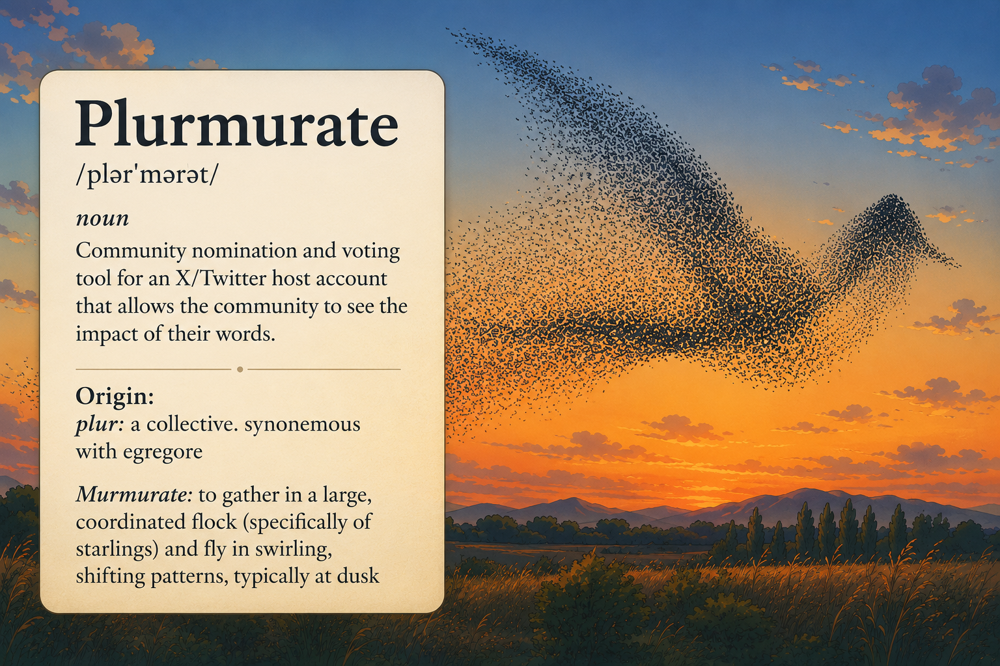
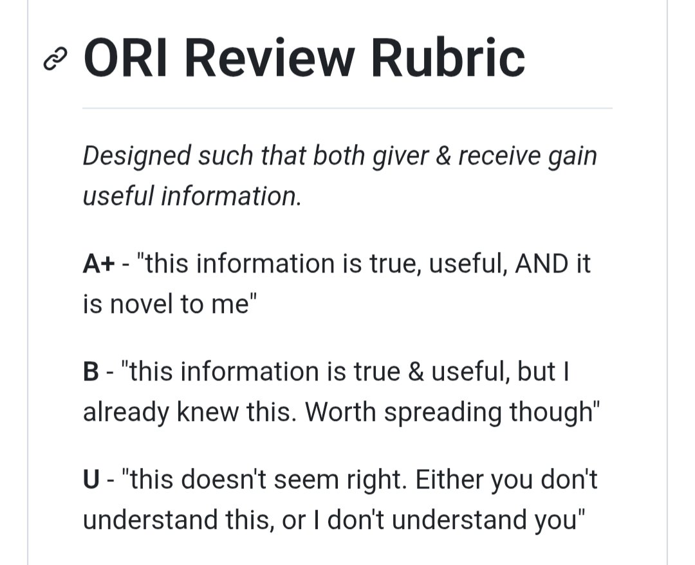

<h1 align="center">Plurmurate</h1>

<p align="center">
  <strong>This repo is mostly vibe coded so use ate your own risk lmao *</strong>
  <br />
</p>

<p align="center">
  
</p>

<p align="center">
Plurmurate is a community nomination and voting tool for deciding what a shared X/Twitter account should post, quote, repost, or reply to. Users authenticate with X, submit proposed posts as nominations, and vote on nominations (optionally) using the A/B/U rating system developed by <a href="https://x.com/DefenderOfBasic">Defender</a>:
</p>
<p align="center">
  
</p>

Demo: https://plurmurate.sidenotes.workers.dev/

# Roadmap

1. Support polls and other post subtleties that are not covered by plain text/media, quote, repost, and reply nominations.
2. Add support for paid partnership posts with various billing options.
3. Add an avatar signature that dynamically combines the host avatar with the nominator avatar, potentially using AI-assisted image generation.

# Setup

## X/Twitter Setup

Note: Automated sending uses paid X API write requests. Budget at least `$0.015` per post; any post containing a URL is taxed at `$0.20` per post for automated sending. If the X developer account runs out of credits, use the host controls to mark a nomination as sent manually after posting it yourself.

Create two separate X developer apps with the **Create App** button.

Name them `plurmurate-staging` and `plurmurate-production` for example.
- `plurmurate-staging`: used for local development and staging.
- `plurmurate-production`: used for the live production deployment.

Click the set up button in `User authentication settings`

For both apps, configure user authentication:

- App permissions: **Read and write**.
  - Do not choose **Read and write and Direct message**.
- OAuth scopes: include the scopes needed for login, reading users/posts, offline token refresh, and posting (`tweet.read`, `tweet.write`, `users.read`, `offline.access`). No Direct Message scope is needed.
- Type of App: **Web App, Automated App or Bot**.
  - Do not choose **Native App**.
- Use any temporary placeholder URL for now until the app has been deployed or tunneled e.g:
  - Callback URI / Redirect URL: https://lol.com/callback
  - Website URL: https://lol.com/

Create production and staging secrets:

```bash
cp .dev.vars.staging.example .dev.vars.staging
cp .dev.vars.production.example .dev.vars.production
```

Edit `.dev.vars.staging`:

```env
SESSION_SECRET=replace-with-at-least-32-random-characters
X_CLIENT_ID=your-staging-x-oauth-client-id
X_CLIENT_SECRET=your-staging-x-oauth-client-secret
DISCORD_BOT_TOKEN=your-discord-bot-token  # see setup below
```

Edit `.dev.vars.production`:

```env
SESSION_SECRET=replace-with-at-least-32-random-characters
X_CLIENT_ID=your-production-x-oauth-client-id
X_CLIENT_SECRET=your-production-x-oauth-client-secret
DISCORD_BOT_TOKEN=your-discord-bot-token # see setup below
```

## Discord Setup (Optional)

1. Create a new Discord application here: https://discord.com/developers/applications
2. Give it a nice name like `plurmurate-hostaccountname`.
3. Add a nice description like `Nominate tweets to @accountname here: <insert url>`.
4. Go to **General Information** and copy the **Application ID**. This is the value used as `client_id` in the invite URL (below).
5. Go to the **Bot** tab, click **Reset Token**, and copy the token. Paste it into `DISCORD_BOT_TOKEN` in the `.dev.vars` files.
6. Create a channel in the target Discord server. Copy the channel ID and paste it into `DISCORD_CHANNEL_ID` in the `wrangler.jsonc` file.
7. Invite the bot to the Discord server with an OAuth URL that includes the `bot` scope:

```text
https://discord.com/oauth2/authorize?client_id=YOUR_APPLICATION_ID&scope=bot%20applications.commands&permissions=19456
```

Replace `YOUR_APPLICATION_ID` with the Application ID from step 4.

The `bot` scope is required to add the bot user to the server. `applications.commands` alone only installs commands and will not make the bot appear as a server member.

The permission value above is `19456`, which includes:

  - View Channel
  - Send Messages
  - Embed Links

Recommended if the channel has stricter moderation:

- Read Message History is not required for sending, but is commonly included.
- Make sure no channel-specific permission override denies View Channel, Send Messages, or Embed Links.

If Discord says the installation type is unsupported, open the app's **Installation** settings and make sure **Guild Install** is enabled. You need **Manage Server** permission in the target Discord server to authorize the bot.

## App Setup

### Staging/local

Create local Wrangler config:

```bash
cp wrangler.example.jsonc wrangler.jsonc
```

Create the staging D1 database:

```bash
npx wrangler d1 create plurmurate
# If it asks to add the config on your behalf say No
npx wrangler r2 bucket create plurmurate-media
# If it asks to add the config on your behalf say No
```

Edit `wrangler.jsonc`:

- Set the `database_id` printed by `npx wrangler d1 create plurmurate`.
- Set the host account vars `X_HOST_HANDLE` and `X_HOST_USER_ID` (find id here: https://twxpicker.com/user-id-finder)
- Set `DISCORD_CHANNEL_ID` if Discord notifications should be enabled locally or in staging.
- Set `GITHUB_REPOSITORY_URL` to your GitHub repository URL (for the icon in the topbar).

Apply migrations to the local D1 database, then start the dev server:

```bash
npm install
npm run db:migrate:local
npm run db:migrate:staging:remote
npm run dev
# once its running start a tunnel by tapping t + enter
```

Copy the URL from the tunnel to the staging X app configuration **Website URL** and **Callback URI / Redirect URL** setting (you need to do this every time you start the local tunnel):
- Website URL: https://tunnel-url.cloudflare.com
- Callback URI / Redirect URL: https://tunnel-url.cloudflare.com/auth/x/callback

### Production

Create production resources:

```bash
npx wrangler d1 create plurmurate-production
# If it asks to add the config on your behalf say No
npx wrangler r2 bucket create plurmurate-media-production
# If it asks to add the config on your behalf say No
```

Edit `wrangler.jsonc`:
- Set the `database_id` printed by `npx wrangler d1 create plurmurate-production`.
- Set `DISCORD_CHANNEL_ID` if Discord notifications should be enabled in production.
- Set `GITHUB_REPOSITORY_URL` to your GitHub repository URL (for the icon in the topbar).

Upload production secrets:

```bash
npx wrangler secret bulk .dev.vars.production --env production
```

Copy the URL to the production X app configuration **Website URL** and **Callback URI / Redirect URL** setting:
- Website URL: https://example.project.workers.dev/
- Callback URI / Redirect URL: https://example.project.workers.dev/auth/x/callback


# Development

```bash
npm run dev
# once its running start a tunnel by tapping t + enter
```

Copy the URL from the tunnel to the staging X app configuration **Website URL** and **Callback URI / Redirect URL** setting (you need to do this every time you start the local tunnel):
- Website URL: https://tunnel-url.cloudflare.com
- Callback URI / Redirect URL: https://tunnel-url.cloudflare.com/auth/x/callback


# Deploy

### Staging (Optional)

You have a local setup but if you want to be safe you can deploy staging to a seperate worker. You can also use staging if you get tired of copying the local tunnel url to the x app configuration. But then you need to deploy after each change anyway.

Upload staging secrets:

```bash
npx wrangler secret bulk .dev.vars.staging --env staging
```

```bash
npm run db:migrate:staging:remote
npm run deploy:staging
```

### Production

Apply production migrations and deploy:

```bash
npm run db:migrate:production:remote
npm run deploy:production
```

# Notes

## Discord bot info

Users log in with X and nominate one of four post types:

- **text post**: original text and optional media for the host account.
- **quote tweet**: text plus a target X post URL.
- **repost**: a target X post URL, with no additional text or media.
- **reply**: text plus the X post URL being replied to.

When a target X post is entered, Plurmurate stores the URL and attempts to cache an X/oEmbed preview so voters can inspect the target from inside the feed. Submitted nominations start as pending, then the approval service evaluates the current A/B/U vote totals against the configured criteria. Qualified nominations are ready for host review. Admins can send qualified nominations automatically through the host X account, mark them as sent manually, deny them, or archive them.

If Discord is configured, the bot sends channel notifications when:

- a new nomination is submitted;
- a nomination qualifies for review;
- a nomination is sent or marked sent manually.

Discord notifications include links to the target post, published post when available, the host X account when `X_HOST_HANDLE` is configured, and the submitting or sending X account when Plurmurate knows the username. The Discord bot invite must include **View Channel**, **Send Messages**, and **Embed Links** so those links and X previews render cleanly in Discord.
