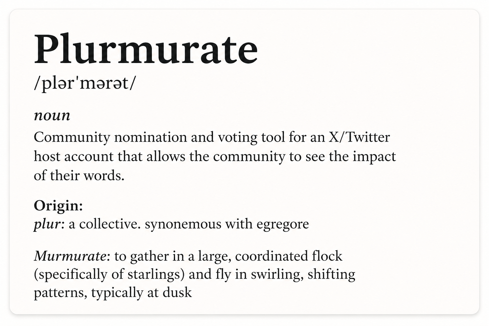

|  |  |
| :---: | :---: |

Plurmurate is a community nomination and voting tool for deciding what a shared X/Twitter account should post, quote, repost, or reply to. Users authenticate with X, submit proposed posts as nominations, and vote on nominations using the A/B/U rating system developed by [Defender](https://x.com/DefenderOfBasic):


# Setup

## X/Twitter Setup

Create two separate X developer apps with the **Create App** button.

Name them `plurmurate-staging` and `plurmurate-production` for example.
- `plurmurate-staging`: used for local development and staging.
- `plurmurate-production`: used for the live production deployment.

For both apps, configure user authentication:

- App permissions: **Read and write**.
  - Do not choose **Read and write and Direct message**.
- Type of App: **Web App, Automated App or Bot**.
  - Do not choose **Native App**.

Initial app info:

- Use any temporary placeholder URL until the app has been deployed or tunneled.
- After you have the real URL, update both the Website URL and callback URL.
- The callback URL format is `{site-url}/auth/x/callback`.

Staging/local URL flow:

```bash
npm run dev
# After it starts
# run the dev tunnel server terminal: press t, then Enter
```

You need to edit the staging X app callback and base url each time you restart the server:
- Use the Cloudflare tunnel URL as the `plurmurate-staging` Website URL.
- Use `{tunnel-url}/auth/x/callback` as the `plurmurate-staging` callback URL.

For production you need to change the URL only once, after you followed the deploy steps below


This app requests these X scopes:

```text
users.read tweet.read tweet.write media.write offline.access follows.read
```

Required secret values:

```env
SESSION_SECRET=replace-with-at-least-32-random-characters
X_CLIENT_ID=your-x-oauth-client-id
X_CLIENT_SECRET=your-x-oauth-client-secret
```

## App Setup

Install dependencies:

```bash
npm install
```

Create local staging secrets:

```bash
cp .dev.vars.staging.example .dev.vars.staging
```

Edit `.dev.vars.staging`:

```env
SESSION_SECRET=replace-with-at-least-32-random-characters
X_CLIENT_ID=your-staging-x-oauth-client-id
X_CLIENT_SECRET=your-staging-x-oauth-client-secret
```

Apply local D1 migrations, then start the dev server:

```bash
npm run db:migrate:local
npm run dev
```

Local dev behavior:

- `npm run dev` uses `CLOUDFLARE_ENV=staging`.
- Wrangler reads `env.staging` from `wrangler.jsonc`.
- Wrangler loads secrets from `.dev.vars.staging`.

## Cloudflare Environments

Named Wrangler environments:

- `staging`: used by `npm run dev`, local D1 migrations, and staging deploys. It deploys to the `plurmurate-staging` Worker.
- `production`: used for the live app. It deploys to the `plurmurate` Worker.

Wrangler config rules:

- Each environment needs its own `vars`, `d1_databases`, and `r2_buckets`.
- Wrangler does not inherit those keys from the top level into named environments.
- Old Workers from previous experiments can be ignored unless you intentionally reuse them.

Intended split:

```text
staging Worker:     plurmurate-staging
production Worker:  plurmurate

staging D1:         plurmurate
production D1:      plurmurate-production

staging R2:         plurmurate-media
production R2:      plurmurate-media-production
```

Binding names:

- Resource names can differ by environment.
- Binding names must stay `DB` and `MEDIA_BUCKET` because the app reads `env.DB` and `env.MEDIA_BUCKET`.

## Production Setup

Create production resources:

```bash
npx wrangler d1 create plurmurate-production
npx wrangler r2 bucket create plurmurate-media-production
```

Update `wrangler.jsonc`:

- Set `env.production.d1_databases[0].database_id` to the production D1 `database_id`.

Create production secrets:

```bash
cp .dev.vars.production.example .dev.vars.production
```

Edit `.dev.vars.production` with only secrets:

```env
SESSION_SECRET=replace-with-at-least-32-random-characters
X_CLIENT_ID=your-production-x-oauth-client-id
X_CLIENT_SECRET=your-production-x-oauth-client-secret
X_PUBLISHING_ACCESS_TOKEN=
X_PUBLISHING_REFRESH_TOKEN=
```

Do not include keys already configured as plain `vars` in `wrangler.jsonc`:

```text
DATABASE_PROVIDER
STORAGE_PROVIDER
PUBLISHING_WORKFLOW
X_HOST_USER_ID
X_HOST_HANDLE
```

Upload production secrets:

```bash
npx wrangler secret bulk .dev.vars.production --env production
```

Apply production migrations and deploy:

```bash
npm run db:migrate:production:remote
npm run build:production
npm run deploy:production
```

## Staging Deploy

```bash
npm run db:migrate:staging:remote
npm run build:staging
npm run deploy:staging
```

## Scripts

```bash
npm run dev                            # Start local dev against env.staging
npm run build:staging                  # Build the staging app
npm run build:production               # Build the production app
npm run typecheck                      # Run TypeScript checks
npm run lint                           # Run ESLint
npm run db:migrate:local               # Apply local D1 migrations for staging dev
npm run db:migrate:staging:remote      # Apply remote D1 migrations to staging
npm run db:migrate:production:remote   # Apply remote D1 migrations to production
npm run deploy:staging                 # Deploy staging with Wrangler
npm run deploy:production              # Deploy production with Wrangler
```
